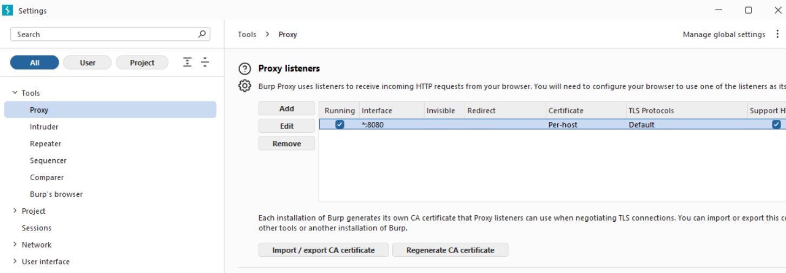
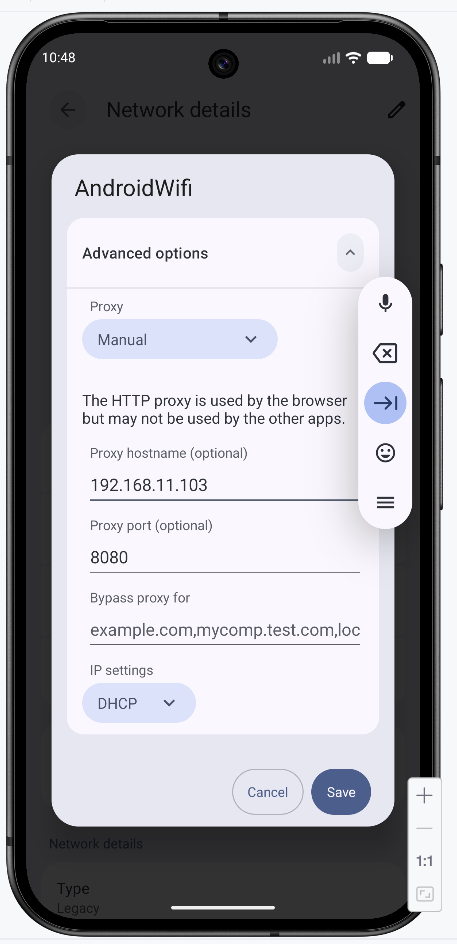
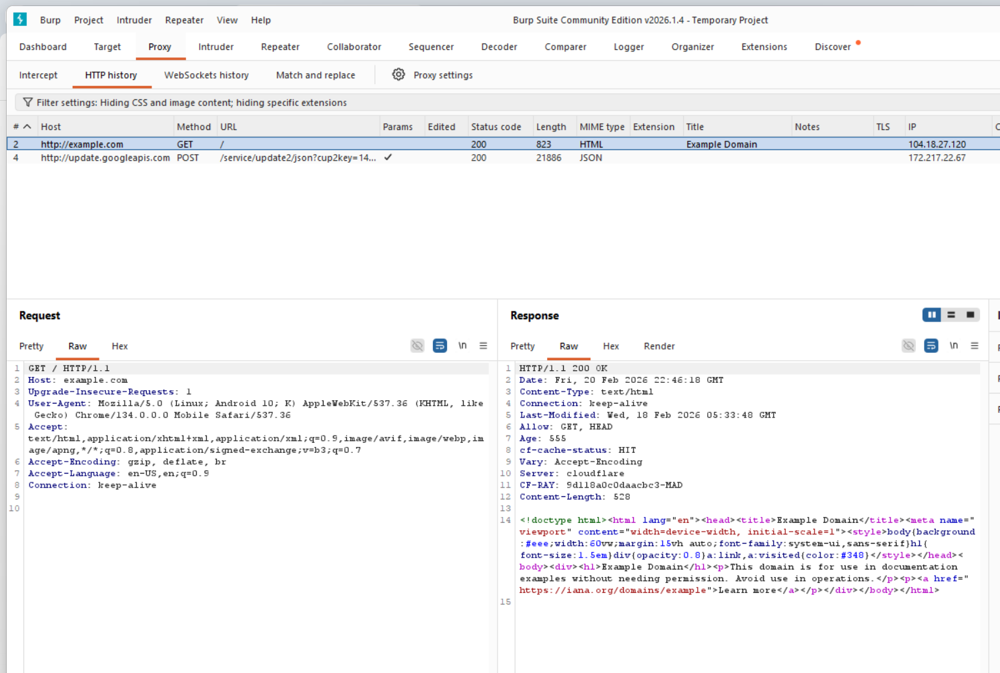
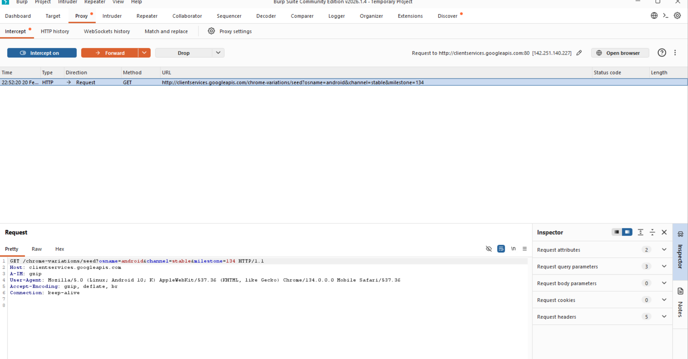
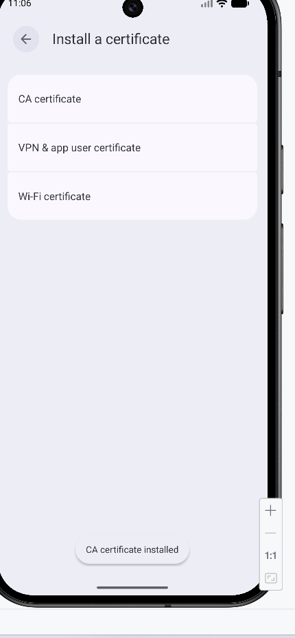

# LAB 3 – Observation du trafic HTTP(S) Android avec Burp Suite

##  Objectif

Observer et analyser le trafic HTTP et HTTPS d’un navigateur Android (émulateur) via Burp Suite dans un environnement de laboratoire contrôlé.

##  Environnement

- Machine hôte : Windows
- Outil proxy : Burp Suite Community Edition
- Émulateur : Android Studio 
- Port proxy : 8080
- Réseau : Environnement local isolé

---

##  Configuration

### 1 Configuration du Proxy Listener

Burp configuré pour écouter sur toutes les interfaces (*:8080).

---

### 2️ Configuration du Proxy dans l’émulateur

Proxy configuré en mode manuel :

- Hostname : 192.168.11.103
- Port : 8080

---

##  Capture HTTP

Navigation vers http://example.com.

Le trafic apparaît dans HTTP history.

##  Interception contrôlée

Activation temporaire d’Intercept pour observer une requête bloquée.

Paramètres visibles dans l’URL :
- osname=android
- channel=stable
- milestone=134

---

##  HTTPS et certificat CA

Sans certificat CA :
- HTTPS bloque l’interception

Installation du certificat CA de Burp dans l’émulateur uniquement :

Après installation :
- Les requêtes HTTPS sont visibles
- Le proxy peut analyser le trafic chiffré

---

##  Analyse

### Données observées

- Paramètres en clair dans l’URL
- Headers HTTP
- User-Agent détaillant l’environnement
- Connexions HTTPS déchiffrées en labo

### Risques potentiels

- Exposition de paramètres sensibles en URL
- Trafic interceptable si autorité compromise
- Nécessité de bonnes pratiques côté serveur

##  Compétences acquises

- Configuration d’un proxy d’analyse
- Compréhension HTTP vs HTTPS
- Analyse de requêtes réseau
- Compréhension du rôle d’un certificat CA
- Production d’une preuve d’audit documentée

---
